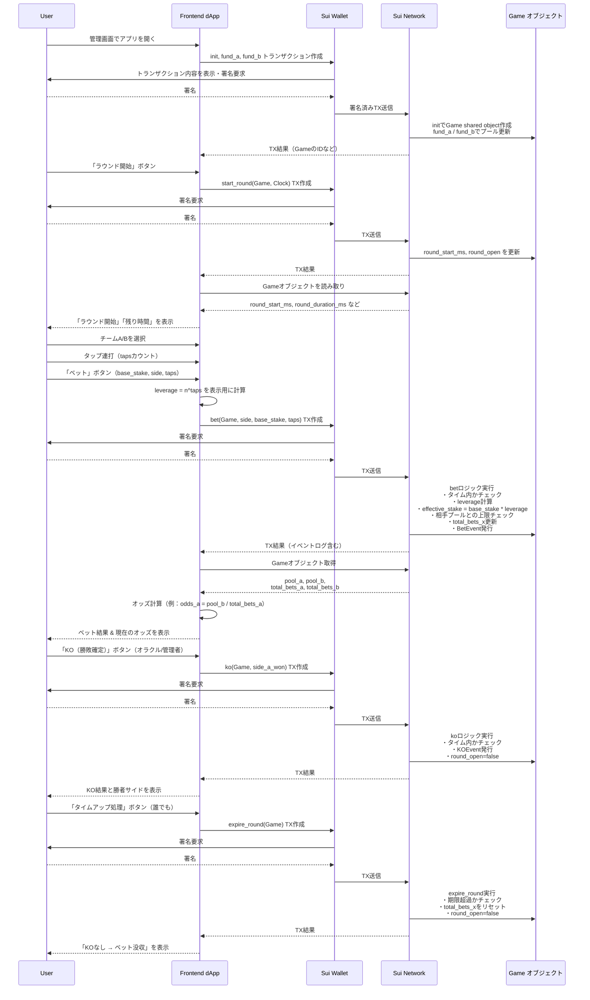

# 格闘参加型レバレッジベットアプリ 

## 1. 概要

本プロジェクトは、ユーザーが **Team A / Team B** のどちらかを選び、
タップ操作によってレバレッジを上げながらベットする **格闘参加型アプリ** を構築する。

1ラウンドごとに時間制限があり、
ラウンド内でのベット結果・KO/タイムアップ・攻撃演出（バイブ）によって体験が変化する。

* オンチェーンロジック：Sui（Move）のスマートコントラクト
* フロントエンド：Expo（React Native）アプリ
* バックエンド：Node系 API サーバー ＋ Supabase（ユーザー管理・リアルタイム通知）

> 注: 「**初心者が1時間で完成できるMVP**」を最優先とし、
> Vaultの高度な運用ロジックやバイブ演出のバリエーションなどはフェーズ分けして段階的に導入する。

---

## 2. 目的 / ゴール

### 2.1 プロダクトとしての目的

* ユーザーが **タップでレバレッジを上げてベットできる体験** を提供する。
* ベットロジックや資金上限（相手サイドの原資まで）を **Sui 上に明示し、改ざん困難** な形で提供する。
* ラウンドごとの時間制限（`m` ミリ秒）と、
  KO / タイムアップ時の挙動を **プロトコルとして定義** する。
* 運営が攻撃演出をトリガーし、
  対象チームのプレイヤー端末のみバイブレーションさせる機能を提供する（拡張フェーズでも可）。

### 2.2 MVPのゴール

* 単一の Game（試合）オブジェクトを対象として、

  * ラウンド開始
  * ベット（タップレバレッジ）
  * KO確定
  * タイムアップ処理（没収）
    が一連のフローとして動くこと。
* UI は1〜2画面構成で、**初心者エンジニアでも1時間程度でMVPを組める** シンプルさを維持する。

---

## 3. スコープ

### 3.1 対象ユーザー

* **一般プレイヤー（Player）**

  * Team A / Team B のどちらかに参加し、タップ操作でレバレッジを上げてベットする。
* **運営（Operator）**

  * 初期資金投入（プール構築）
  * ラウンド開始
  * KO判定
  * 攻撃演出（バイブ）のトリガー
    など、試合全体を管理する。

### 3.2 対象プラットフォーム / 技術スタック

* モバイルアプリ：**Expo（React Native）**
* ブロックチェーン：**Sui devnet / testnet**
* バックエンド：**Node系 API サーバー**
* データベース・認証・リアルタイム：**Supabase（PostgreSQL + Realtime）**

### 3.3 MVPでやること

* 単一 Game の管理（複数試合同時進行は対象外）
* A/B 2サイドのみ（3サイド以上のマーケットは対象外）
* シンプルなベットロジック（`leverage = n ^ taps`）
* オッズ表示（`odds_a = pool_b / total_bets_a` など）
* devnet/testnet 上での動作確認

### 3.4 MVPではやらない（拡張候補）

* マルチマッチ・トーナメント管理
* ユーザー同士のP2Pマッチメイキング
* Vaultの利回り運用や複雑な手数料設計
* ランキング・実績（Achievements）・NFTアバターなどのメタゲーム要素
* 本番ネット（mainnet）での運用

---

## 4. 用語定義

* **Team A / Team B**
  ベット対象となる2つのサイド。格闘の両選手側のイメージ。

* **Round（ラウンド）**
  一定時間（`round_duration_ms = m` ミリ秒）のゲーム区間。
  ラウンド開始〜終了の間のみベットが有効。

* **Tap（タップ）**
  プレイヤーが UI 上のボタンをタップする行為。
  タップ回数 `taps` に応じてレバレッジが上昇する。

* **Leverage（レバレッジ）**
  `base_stake` に掛けられる倍率。
  `leverage = n ^ taps` （`n` は定数、例: `n = 2`）。

* **Effective Stake**
  レバレッジ後の賭け金。
  `effective_stake = base_stake * leverage`

* **Vault_TeamA / Vault_TeamB**
  Team A / Team B に対して賭けられた資金を管理するオンチェーン上の Vault オブジェクト。

  * Team A のプレイヤー資金 → `Vault_TeamA`
  * Team B のプレイヤー資金 → `Vault_TeamB`

* **Vault のロック / リザーブ**

  * **ロック（lock）**
    ベットしたプレイヤーの元本（`base_stake` または `effective_stake` の一部）を、
    ラウンド終了 or 精算が完了するまで出金不可としてマークする状態。
  * **リザーブ（reserve）**
    相手サイドへの最大払い戻し額を見積り、その分を Vault から確保しておくこと。
    これにより、**相手サイドの原資を超えるベット** が入らないように上限管理を行う。

* **Game オブジェクト（shared object）**
  Sui 上で共有される、試合全体の状態を保持する shared object。
  例：

  * `pool_a`, `pool_b`（各サイドのプール残高）
  * `total_bets_a`, `total_bets_b`（各サイドの合計ベット額）
  * `round_start_ms`, `round_duration_ms`
  * `round_open`（ラウンドが現在ベット受付中かどうか）
  * `winner_side`（KO確定後の勝者サイド）

* **イベント**

  * **BetEvent**：ベットが成立した際に発行されるイベント
  * **KOEvent**：KO確定時に発行されるイベント

---

## 5. アーキテクチャ概要

### 5.1 オンチェーン（Sui Move）

* Game shared object の定義
* `init`, `fund_a`, `fund_b` など初期セットアップ用関数
* `start_round`, `bet`, `ko`, `expire_round` といったゲームロジック
* Vault のロック・リザーブ計算
* ベット・KO・ラウンド終了などのイベント発行

### 5.2 バックエンド（APIサーバー + Supabase）

* ユーザーアカウント管理（例：Walletアドレス紐づけ）
* イベントサブスクライブ or ポーリングによる状態反映
* 攻撃演出（バイブ）用のリアルタイム通知

  * 例：`team = A` のプレイヤーだけに向けて「攻撃発生」イベントを配信

### 5.3 フロントエンド（Expo / React Native）

* Team A / Team B の選択 UI
* タップ連打による `taps` カウント＆リアルタイム表示
* ベット実行（Wallet 連携）
* ラウンド残り時間のカウントダウン表示
* 勝敗表示・オッズ表示
* （拡張）攻撃演出受信時に対象チームの端末のみバイブレーション

---

## 6. ゲーム仕様（MVP）

### 6.1 ラウンド

* ラウンド開始時に以下を設定：

  * `round_start_ms`：開始時刻（ミリ秒）
  * `round_duration_ms`：継続時間（ミリ秒）
  * `round_open = true`
* ラウンド中 (`now_ms < round_start_ms + round_duration_ms` かつ `round_open == true`) のみベットを受け付ける。

### 6.2 ベット

1. プレイヤーは Team A / Team B を選択。
2. ラウンド中にタップ連打で `taps` を増加。
3. 「ベット」ボタンを押下すると、以下の情報で TX を作成：

   * `side`（A or B）
   * `base_stake`
   * `taps`
4. コントラクト側で

   * 時間内チェック
   * `leverage = n ^ taps` の計算
   * `effective_stake = base_stake * leverage` の計算
   * 相手プールとの上限チェック（Vault リザーブ）
   * `total_bets_x` 更新
   * `BetEvent` 発行

### 6.3 KO（勝敗確定）

* ラウンド中に運営が KO ボタンを押し、`side_a_won` などのパラメータを指定して TX 実行。
* コントラクト側で：

  * 時間内チェック
  * `KOEvent` 発行
  * `round_open = false`
  * `winner_side` を更新

### 6.4 タイムアップ（没収）

* ラウンド終了後（誰でも実行可）、`expire_round` を呼び出し。
* コントラクト側で：

  * 期限超過チェック
  * `total_bets_x` をリセット
  * `round_open = false`
  * KOが出なかったラウンドとして扱い、ベット没収ロジックを適用（MVPではシンプルに「没収」のみ）。

---

## 7. シーケンス図

